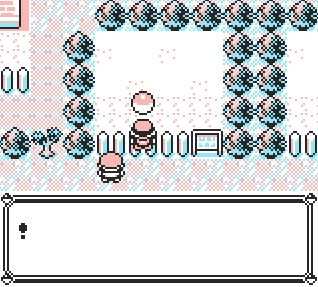

# 🧱 AntiCollision+

This script activates the ability to walk through walls safely, without crashing the game if you try to go beyond map borders!

# 

###  Usage
- Hold B Button to disable collision.
- Release B Button to enable collision.

###  ⚠ Warnings
  <ul>
    <li>If you are already using an <strong>OAM DMA hijack</strong> for another purpose, installing this payload will overwrite it and break any existing functionality.</li>
    <li>Due to its nature, this script is <strong>temporary</strong> and cannot be permanently installed; it will stop working when the game is reset.</li>
    <li>Temporary scripts use the <strong>battle data area</strong>, so the game will <strong>crash if you encounter a trainer</strong> while it is active.</li>
  </ul>
  
<strong>Use with caution!</strong>

-----
### Logic Behind the Hack

  
The effect is achieved using both an <strong>OAM DMA hijack</strong> and a <strong>Map Script Pointer hijack</strong>, which keep the payload running constantly in the background.

  <h3>OAM DMA Hijack</h3>
  <ul>
    <li>Continuously monitors for changes to the <strong>Map Script Pointer</strong>.</li>
    <li>Re-applies the hijack whenever necessary to maintain functionality.</li>
  </ul>

  <h3>Map Script Hijack</h3>
  <ul>
    <li>Checks the <strong>current player's tile</strong> based on the map’s width and height.</li>
    <li>If a <strong> map edge tile</strong> is detected, the script looks for d-pad button presses.</li>
    <li>If the player attempts to move outside the map, <strong>collisions are re-enabled</strong>, except in case there is a <strong>map connection</strong>.</li>
  </ul>

