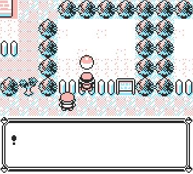

# 🧱 AntiCollision+

This script activates the ability to walk through walls safely, without crashing the game if you try to go beyond map borders!

# 

###  Usage
- Hold B Button to disable collision.
- Release B Button to enable collision.

###  Installation
- First install Nickwriter Migration script. Since the main script is big enough, we need to free up some space, so Nickname Writer is moved inside the script selector.
- Second install AntiCollision+ TimOS. As the name suggests, the script is only compatible with TimOS script selector, so don't try to use it without it!

###  ⚠ Warnings
  <ul>
    <li>The effect is achieved using an OAM DMA hijack, which keeps the payload running constantly in the background. If you are already using the hijack, installing this payload will overwrite it and break any existing functionality.</li>
    <li>Due to its nature, this script cannot survive a game reset. You will need to activate it again.</li>
    <li>Although the script blocks movement beyond the map borders, switching maps can still result in invalid coordinates. This may cause graphical issues or even crash the game if the character ends up too far outside the map. <strong>Use with caution!</strong></li>
  </ul>

-----
### Logic Behind the Hack

  
The effect is achieved using an <strong>OAM DMA hijack</strong>, responsible for running the payload constantly in the background, chained with a <strong>Stack hijack</strong>, that injects and syncronizes payload execution with overworld activity.

  <h3>OAM DMA Hijack</h3>
  <ul>
    <li>Continuously runs the <strong>Stack hijack</strong> inspection payload.</li>
    <li>If specific address is found in specific stack address, it gets replaced with stack payload's one.</li>
  </ul>

  <h3>Stack Hijack</h3>
  <ul>
    <li>Checks the <strong>current player's tile</strong> based on the map’s width and height.</li>
    <li>If a <strong> map edge tile</strong> is detected, the script looks for d-pad button presses.</li>
    <li>If the player attempts to move outside the map, <strong>collisions are re-enabled and all tiles become non walkable</strong>, except in case there is a <strong>map connection</strong>, so the transition can normally happen.</li>
    <li>If <strong>Button B</strong> is detected in any other spot, collision is fully disabled until button is released again.</li>
  </ul>

