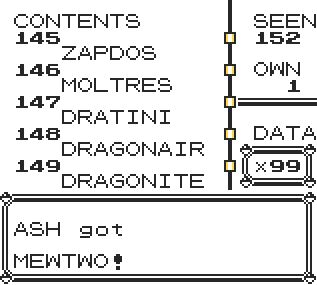

# 🥚 DexGiver+

Get any pokemon in any level — instantly and effortlessly!

# 

DexGiver+ introduces a smooth, user-friendly selection menu based on the Pokédex engine, giving you full control and visibility over your collection. Perfect for game customization, testing, or just having fun.

### ⚠️ Warning

This script uses an OAM DMA hijack to bypass certain ROM limitations.
Any other active DMA hijack will stop working while this is running.

-----
### Installation Options

Choose the format that best fits your setup:
- Installer Version: Permanently installs PokeTeacher+ at a specific memory address within the TimOS environment.
Perfect for long-term use.
- Standalone Version: A temporary version that runs until a trainer battle starts. Great for single session or testing.
