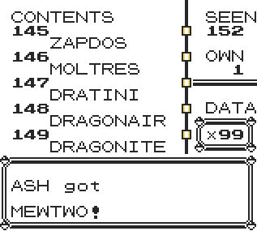

# 🥚 DexGiver+

Get any pokemon at any level in style!

# 

DexGiver+ introduces a smooth, user-friendly selection menu based on the Pokédex engine, giving you full control and visibility over your collection. Useful for game customization, testing, or just having fun.

### ⚠️ Warning

This script uses an OAM DMA hijack to bypass certain ROM limitations.
Any other active DMA script will stop working while this is running.

-----
### Installation Options

Choose the format that best fits your setup:
- Installer Version: Permanently installs PokeTeacher+ at a specific memory address within the TimOS environment.
Perfect for long-term use.
- Standalone Version: A temporary version that can run until a trainer battle starts. Great for single session or testing.

---

**Red/Blue Installer**
```
21 e9 c6 7e 34 87 21 c7 c7 11 ce c9 85 6f 73 23 72 01 b1 00  
21 cf d8 c3 b5 00 f3 21 80 ff 36 cd 23 36 33 23 36 ca 23 36  
e2 fb 21 0a d3 11 7f ca 01 13 00 d5 c5 e5 c5 e5 cd b5 00 e1  
c1 0b af 3d cd e0 36 36 7f af ea 91 cf 06 10 21 00 40 cd d6  
35 f3 21 80 ff 36 3e 23 36 c3 23 36 e0 23 36 46 fb d1 c1 e1  
c5 d5 cd b5 00 e1 c1 1b 2b 1a b6 12 0d 20 f8 cd 01 37 cd d7  
3d cd ba 20 c3 29 24 cd 3b ca 0e 46 3e c3 c9 21 d1 df 3e 40  
be c0 23 be c0 3e ca 32 3e 4c 77 c9 d2 42 40 3e 64 ea 97 cf  
cd 57 2d a7 20 1f fa 26 cc 47 fa 36 cc 80 3c ea 1e d1 06 10  
21 f9 4f cd d6 35 fa 1e d1 47 fa 96 cf 4f cd 48 3e cd 0f 19  
c3 1d 40
```

**Yellow Installer**
```
21 e9 c6 7e 34 87 21 c0 c7 11 ce c9 85 6f 73 23 72 01 b1 00  
21 ce d8 c3 b1 00 f3 21 80 ff 36 cd 23 36 33 23 36 ca 23 36  
e2 fb 21 09 d3 11 7f ca 01 13 00 d5 c5 e5 c5 e5 cd b1 00 e1  
c1 0b af 3d cd 6e 16 36 7f af ea 90 cf 06 10 21 00 40 cd 84  
3e f3 21 80 ff 36 3e 23 36 c3 23 36 e0 23 36 46 fb d1 c1 e1  
c5 d5 cd b1 00 e1 c1 1b 2b 1a b6 12 0d 20 f8 cd f8 36 cd db  
3d cd 6f 1e c3 1c 23 cd 3b ca 0e 46 3e c3 c9 21 d5 df 3e 40  
be c0 23 be c0 3e ca 32 3e 4c 77 c9 d2 42 40 3e 64 ea 96 cf  
cd 51 2c a7 20 1f fa 26 cc 47 fa 36 cc 80 3c ea 1d d1 06 10  
21 86 50 cd 84 3e fa 1d d1 47 fa 95 cf 4f cd 59 3e cd dd 16  
c3 1d 40
```