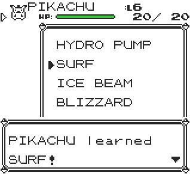

# 🎓 PokeTeacher+

Teach any move to any Pokémon in your party, in style!


# 

PokeTeacher+ adds a clean and easy-to-use move selection menu, allowing full control over your Pokémon’s moveset. Ideal for game customisation, testing, or just having fun.

### ⚠️ Warning

This script uses an OAM DMA hijack to bypass certain ROM limitations.
Any other active DMA hijack will stop working while this is running.

-----
### Installation Options

Choose the format that best fits your setup:
* **Installer Version:** Permanently installs the script at a specific memory address in the TimOS Script Selector. Ideal for long-term use.
* **Standalone Version:** A temporary version that can run until a trainer battle begins. Ideal for single-session use or testing.

---

**Red/Blue Installer**
```
21 e9 c6 7e 34 87 21 c7 c7 11 ce c9 85 6f 73 23 72 01 a8 00  
21 cf d8 c3 b5 00 f3 21 80 ff 36 cd 23 36 3f 23 36 ca 23 36  
e2 fb af ea cb cf ea 7d d0 cd fc 13 fa 92 cf e0 ef 30 19 cd  
0f 19 cd be 3d ea 36 cc f3 21 80 ff 36 3e 23 36 c3 23 36 e0  
23 36 46 d9 21 75 ca 7d ea 8b cf 7c ea 8c cf af ea 93 cf ea  
26 cc 3c ea 94 cf 23 3c 22 fe a6 20 fa af 4f 3d 77 21 75 ca  
cd e6 2b a7 28 ac f0 ef ea 92 cf 21 43 6e cd 75 13 18 9f cd  
47 ca 0e 46 3e c3 c9 21 dd df 3e 87 be c0 23 3e 2c be c0 3e  
ca 32 3e 5a 77 c9 cb 47 ca 87 2c fa 26 cc 47 fa 36 cc 80 3c  
3c ea e0 d0 ea 1e d1 cd 58 30 c3 11 2d a3
```

**Yellow Installer**
```
21 e9 c6 7e 34 87 21 c0 c7 11 ce c9 85 6f 73 23 72 01 a8 00  
21 ce d8 c3 b1 00 f3 21 80 ff 36 cd 23 36 3f 23 36 ca 23 36  
e2 fb af ea ca cf ea 7c d0 cd c8 11 fa 91 cf e0 ef 30 19 cd  
dd 16 cd c2 3d ea 36 cc f3 21 80 ff 36 3e 23 36 c3 23 36 e0  
23 36 46 d9 21 75 ca 7d ea 8a cf 7c ea 8b cf af ea 92 cf ea  
26 cc 3c ea 93 cf 23 3c 22 fe a6 20 fa af 4f 3d 77 21 75 ca  
cd e0 2a a7 28 ac f0 ef ea 91 cf 21 c8 6b cd 35 11 18 9f cd  
47 ca 0e 46 3e c3 c9 21 e1 df 3e 81 be c0 23 3e 2b be c0 3e  
ca 32 3e 5a 77 c9 cb 47 ca 81 2b fa 26 cc 47 fa 36 cc 80 3c  
3c ea df d0 ea 1d d1 cd 4d 2f c3 0b 2c a3
```

---

**Red/Blue Standalone**
```
f3 21 80 ff 36 cd 23 36 26 23 36 d9 23 36 e2 fb af ea cb cf  
ea 7d d0 cd fc 13 fa 92 cf e0 ef 30 19 cd 0f 19 cd be 3d ea  
36 cc f3 21 80 ff 36 3e 23 36 c3 23 36 e0 23 36 46 d9 21 5c  
d9 7d ea 8b cf 7c ea 8c cf af ea 93 cf ea 26 cc 3c ea 94 cf  
23 3c 22 fe a6 20 fa af 4f 3d 77 21 5c d9 cd e6 2b a7 28 ac  
f0 ef ea 92 cf 21 43 6e cd 75 13 18 9f cd 2e d9 0e 46 3e c3  
c9 21 dd df 3e 87 be c0 23 3e 2c be c0 3e d9 32 3e 41 77 c9  
cb 47 ca 87 2c fa 26 cc 47 fa 36 cc 80 3c 3c ea e0 d0 ea 1e  
d1 cd 58 30 c3 11 2d a3

```

**Yellow Standalone**
```
f3 21 80 ff 36 cd 23 36 25 23 36 d9 23 36 e2 fb af ea ca cf  
ea 7c d0 cd c8 11 fa 91 cf e0 ef 30 19 cd dd 16 cd c2 3d ea  
36 cc f3 21 80 ff 36 3e 23 36 c3 23 36 e0 23 36 46 d9 21 5b  
d9 7d ea 8a cf 7c ea 8b cf af ea 92 cf ea 26 cc 3c ea 93 cf  
23 3c 22 fe a6 20 fa af 4f 3d 77 21 5b d9 cd e0 2a a7 28 ac  
f0 ef ea 91 cf 21 c8 6b cd 35 11 18 9f cd 2d d9 0e 46 3e c3  
c9 21 e1 df 3e 81 be c0 23 3e 2b be c0 3e d9 32 3e 40 77 c9  
cb 47 ca 81 2b fa 26 cc 47 fa 36 cc 80 3c 3c ea df d0 ea 1d  
d1 cd 4d 2f c3 0b 2c a3
```
