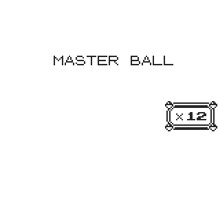

## ItemGiver

A minimal script that gives you any item in any quantity.

# 

**Warning**

The script is temporarily stored in trainer battle data, which is overwritten when a trainer battle begins.

To work around this limitation, use the [MultiScript Installer](https://github.com/M4n0zz/Gen1PokeScripts/tree/main/Effects/%5B%CE%92%5D%20MultiScript) instead.

---

**Red/Blue**
```
cd 0f 19 cd 29 24 3e ff ea 97  
cf cd 57 2d a7 c0 fa 96 cf f5  
ea 1e d1 cd cf 2f 21 09 c4 11  
6d cd cd 55 19 3e ff ea 97 cf  
cd 57 2d c1 a7 20 d1 fa 96 cf  
4f cd 2e 3e 18 c8
```

**Yellow**
```
cd dd 16 cd 1c 23 3e ff ea 96  
cf cd 51 2c a7 c0 fa 95 cf f5  
ea 1d d1 cd c4 2e 21 09 c4 11  
6d cd cd 23 17 3e ff ea 96 cf  
cd 51 2c c1 a7 20 d1 fa 95 cf  
4f cd 3f 3e 18 c8
```