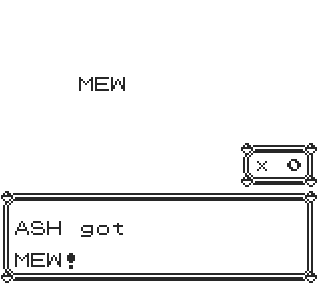

## PokeGiver

A minimal script that gives you any non glitch Pokemon to any non glitch level.

# 

**Warning**

The script is temporarily stored in trainer battle data, which is overwritten when a trainer battle begins.

To work around this limitation, use the [MultiScript Installer](https://github.com/M4n0zz/Gen1PokeScripts/tree/main/Effects/%5B%CE%92%5D%20MultiScript) instead.

--- 

**Red/Blue**
```
cd 0f 19 cd 29 24 3e 97 ea 97  
cf cd 57 2d a7 c0 fa 96 cf 11  
1e d1 12 06 10 21 f9 4f cd d6  
35 1a f5 cd 9e 2f 21 09 c4 11  
6d cd cd 55 19 3e 64 ea 97 cf  
cd 57 2d c1 a7 20 c7 fa 96 cf  
4f cd 48 3e 18 be
```

**Yellow**
```
cd dd 16 cd 1c 23 3e 97 ea 96  
cf cd 51 2c a7 c0 fa 95 cf 11  
1d d1 12 06 10 21 86 50 cd 84  
3e 1a f5 cd 93 2e 21 09 c4 11  
6d cd cd 23 17 3e 64 ea 96 cf  
cd 51 2c c1 a7 20 c7 fa 95 cf  
4f cd 59 3e 18 be
```