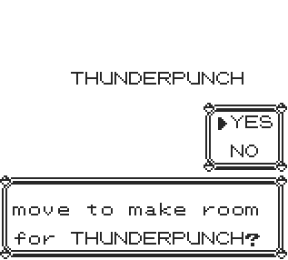

## PokeTeacher

A minimal script that teaches any move to any pokemon.

# 


**Warning**

The script is temporarily stored in trainer battle data, which is overwritten when a trainer battle begins.

To work around this limitation, use the [MultiScript Installer](https://github.com/M4n0zz/Gen1PokeScripts/tree/main/Effects/%5B%CE%92%5D%20MultiScript) instead.

--- 

**Red/Blue**
```
cd 0f 19 cd 29 24 3e a5 ea 97  
cf cd 57 2d a7 c0 fa 96 cf ea  
e0 d0 ea 1e d1 cd 58 30 21 4b  
cf 11 6d cd cd 29 38 21 09 c4  
1e 6d cd 55 19 fa 63 d1 ea 97  
cf cd 57 2d a7 20 c7 fa 96 cf  
3d ea 92 cf 21 43 6e cd 22 39  
18 b8
```

**Yellow**
```
cd dd 16 cd 1c 23 3e a5 ea 96  
cf cd 51 2c a7 c0 fa 95 cf ea  
df d0 ea 1d d1 cd 4d 2f 21 4a  
cf 11 6d cd cd 16 38 21 09 c4  
1e 6d cd 23 17 fa 62 d1 ea 96  
cf cd 51 2c a7 20 c7 fa 95 cf  
3d ea 91 cf 21 c8 6b cd 17 39  
18 b8
```