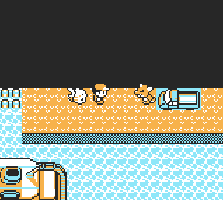

# 🚚 MewTruck+

Finally, the urban legend of Mew under the truck refreshed and accessible for everyone!

# 

MewTruck+ introduces an event where the player is able to push the truck located inside Vermilion Harbor.

Prerequisites
- Ability to use Surf and Strength.
- Access to Vermilion Harbor. If S.S.Anne has already left, you can use [surf down glitch](https://glitchcity.wiki/wiki/Surf_down_glitch) to re-enter the area.

Script activation
- In order to activate the script, you must already be inside the harbor, otherwise the script will self abort.
- After that activate Strength and push the truck. Voila!


### ⚠️ Warning

This script uses MapScript pointer hijack to bypass certain ROM limitations.
Any active similar hijack may stop working while this is running.

-----
Special thanks to [luckytyphlosion](https://pastebin.com/6VWNfEKG) and [MrCheeze](https://pastebin.com/8PAxHSVv) for their versions of the script and the [write-up](https://pastebin.com/UqRzNKxm), which served as the foundation for creating this new one.

-----

### Installation Options

Choose the format that best fits your setup:
* **Installer Version:** Permanently installs the script at a specific memory address in the TimOS Script Selector. Ideal for long-term use.
* **Standalone Version:** A temporary version that can run until a trainer battle begins. Ideal for single-session use or testing.

---

**Red/Blue Installer**
```
21 e9 c6 7e 34 87 21 c7 c7 11 ce c9 85 6f 73 23 72 01 48 01  
21 cf d8 c3 b5 00 01 2f 01 11 b5 d8 21 e7 c9 cd b5 00 21 6e  
d3 3e 52 be c0 36 b5 23 36 d8 c9 21 e3 d9 7e a7 28 2f 3d 20  
08 34 ea e1 d4 ea 10 c1 3c 3d 28 16 21 c0 80 7e 3d 28 0f 11  
80 47 01 0c 05 cd 48 18 21 c2 d9 cd 0f 3f 21 31 c7 3e 0c be  
28 03 77 18 7e fa 62 d3 fe 13 c0 fa 28 d7 0f d0 fa c6 cf fe  
58 c0 fa 28 d5 3d c0 35 11 d0 69 21 00 8c 01 1e 19 78 cd d0  
35 cd 48 18 01 41 03 f2 a0 28 fc f2 a0 20 fc 23 3a ee ff ae  
22 23 3e 8e bc 20 e9 3e e0 e0 49 3e 0d ea 02 c1 3e 02 cd 51  
09 21 a2 72 cd 1a 09 3e ff ea cb cf 21 38 c3 e5 01 58 50 11  
20 6c 70 23 71 23 79 c6 08 4f 1a c6 84 22 13 36 10 23 fe d0  
28 16 fe cf 20 e8 01 58 58 18 e3 3e 03 01 0b 00 ea 9f d0 3e  
17 c3 6d 3e 3e 0c 01 0a 00 cd 6e d9 0e 20 11 04 00 d5 21 39  
c3 3e 08 34 19 3d 20 fb cd af 20 0d 20 f0 cd 69 d9 3e 01 ea  
cb cf ea e1 d4 01 10 a0 d1 e1 70 19 0d 20 fb 3e 01 ea e1 d4  
ea 10 c1 21 14 c2 36 04 23 36 19 23 36 ff 21 1e c2 36 02 c9  
c4 d9 00 8c a4 b6 e7 50 08 3e 15 ea 59 d0 ea 27 d1 cd d0 13  
21 e3 d9 36 01 21 67 d3 cb fe c3 d7 24 00
```

**Yellow Installer**
```
21 e9 c6 7e 34 87 21 c0 c7 11 ce c9 85 6f 73 23 72 01 48 01  
21 ce d8 c3 b1 00 01 2f 01 11 b4 d8 21 e7 c9 cd b1 00 21 6d  
d3 3e 5a be c0 36 b4 23 36 d8 c9 21 e2 d9 7e a7 28 2f 3d 20  
08 34 ea e0 d4 ea 20 c1 3c 3d 28 16 21 80 81 7e 3d 28 0f 11  
71 4b 01 0c 05 cd fe 15 21 bf d9 cd 54 3f 21 31 c7 3e 0c be  
28 03 77 18 7e fa 61 d3 fe 13 c0 fa 27 d7 0f d0 fa c5 cf fe  
58 c0 fa 27 d5 3d c0 35 11 f0 69 21 00 8c 01 1e 19 78 cd eb  
35 cd fe 15 01 41 03 f2 a0 28 fc f2 a0 20 fc 23 3a ee ff ae  
22 23 3e 8e bc 20 e9 3e e0 e0 49 3e 0d ea 02 c1 3e 02 cd 85  
07 21 1e 71 cd 4b 07 3e ff ea ca cf 21 38 c3 e5 01 58 50 11  
40 6c 70 23 71 23 79 c6 08 4f 1a c6 84 22 13 36 04 23 fe d0  
28 16 fe cf 20 e8 01 58 58 18 e3 3e 03 01 0b 00 ea 9e d0 3e  
17 c3 b4 3e 3e 0c 01 0a 00 cd 6d d9 0e 20 11 04 00 d5 21 39  
c3 3e 08 34 19 3d 20 fb cd 64 1e 0d 20 f0 cd 68 d9 3e 01 ea  
ca cf ea e0 d4 01 10 a0 d1 e1 70 19 0d 20 fb 3e 01 ea e0 d4  
ea 20 c1 21 24 c2 36 04 23 36 19 23 36 ff 21 2e c2 36 03 c9  
c3 d9 00 8c a4 b6 e7 50 08 3e 15 ea 58 d0 ea 26 d1 cd 8b 11  
21 e2 d9 36 01 21 66 d3 cb fe c3 d2 23 00
```

---

**Red/Blue Standalone**
```
21 6e d3 3e 52 be c0 36 c2 23 36 d8 c9 21 f0 d9 7e a7 28 2f  
3d 20 08 34 ea e1 d4 ea 10 c1 3c 3d 28 16 21 c0 80 7e 3d 28  
0f 11 80 47 01 0c 05 cd 48 18 21 cf d9 cd 0f 3f 21 31 c7 3e  
0c be 28 03 77 18 7e fa 62 d3 fe 13 c0 fa 28 d7 0f d0 fa c6  
cf fe 58 c0 fa 28 d5 3d c0 35 11 d0 69 21 00 8c 01 1e 19 78  
cd d0 35 cd 48 18 01 41 03 f2 a0 28 fc f2 a0 20 fc 23 3a ee  
ff ae 22 23 3e 8e bc 20 e9 3e e0 e0 49 3e 0d ea 02 c1 3e 02  
cd 51 09 21 a2 72 cd 1a 09 3e ff ea cb cf 21 38 c3 e5 01 58  
50 11 20 6c 70 23 71 23 79 c6 08 4f 1a c6 84 22 13 36 10 23  
fe d0 28 16 fe cf 20 e8 01 58 58 18 e3 3e 03 01 0b 00 ea 9f  
d0 3e 17 c3 6d 3e 3e 0c 01 0a 00 cd 7b d9 0e 20 11 04 00 d5  
21 39 c3 3e 08 34 19 3d 20 fb cd af 20 0d 20 f0 cd 76 d9 3e  
01 ea cb cf ea e1 d4 01 10 a0 d1 e1 70 19 0d 20 fb 3e 01 ea  
e1 d4 ea 10 c1 21 14 c2 36 04 23 36 19 23 36 ff 21 1e c2 36  
02 c9 d1 d9 00 8c a4 b6 e7 50 08 3e 15 ea 59 d0 ea 27 d1 cd  
d0 13 21 f0 d9 36 01 21 67 d3 cb fe c3 d7 24 00
```

**Yellow Standalone**
```
21 6d d3 3e 5a be c0 36 c1 23 36 d8 c9 21 ef d9 7e a7 28 2f  
3d 20 08 34 ea e0 d4 ea 20 c1 3c 3d 28 16 21 80 81 7e 3d 28  
0f 11 71 4b 01 0c 05 cd fe 15 21 cc d9 cd 54 3f 21 31 c7 3e  
0c be 28 03 77 18 7e fa 61 d3 fe 13 c0 fa 27 d7 0f d0 fa c5  
cf fe 58 c0 fa 27 d5 3d c0 35 11 f0 69 21 00 8c 01 1e 19 78  
cd eb 35 cd fe 15 01 41 03 f2 a0 28 fc f2 a0 20 fc 23 3a ee  
ff ae 22 23 3e 8e bc 20 e9 3e e0 e0 49 3e 0d ea 02 c1 3e 02  
cd 85 07 21 1e 71 cd 4b 07 3e ff ea ca cf 21 38 c3 e5 01 58  
50 11 40 6c 70 23 71 23 79 c6 08 4f 1a c6 84 22 13 36 04 23  
fe d0 28 16 fe cf 20 e8 01 58 58 18 e3 3e 03 01 0b 00 ea 9e  
d0 3e 17 c3 b4 3e 3e 0c 01 0a 00 cd 7a d9 0e 20 11 04 00 d5  
21 39 c3 3e 08 34 19 3d 20 fb cd 64 1e 0d 20 f0 cd 75 d9 3e  
01 ea ca cf ea e0 d4 01 10 a0 d1 e1 70 19 0d 20 fb 3e 01 ea  
e0 d4 ea 20 c1 21 24 c2 36 04 23 36 19 23 36 ff 21 2e c2 36  
03 c9 d0 d9 00 8c a4 b6 e7 50 08 3e 15 ea 58 d0 ea 26 d1 cd  
8b 11 21 ef d9 36 01 21 66 d3 cb fe c3 d2 23 00
```
