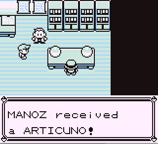

**TrioStarter**

This script is tailored only for Red and Blue version, intended to be used upon starter selection.
It replaces starters with the Legendary Birds!

# 

The script resides on top stack unused space and is copied over during the initial execution. It uses DMA hijack to always run in the backround and it need reactivation upon game reload.

**Red/Blue**
<pre style="font-family: monospace;">
f3 21 80 ff 36 cd 23 36 c5 23  
36 d8 23 36 e2 fb cd cd d8 0e  
46 3e c3 c9 21 1e d1 06 49 3e  
b0 be 28 0b 3c be 28 06 3e 99  
be 20 03 04 04 70 fa 63 d1 a7  
c8 f3 21 80 ff 36 3e 23 36 c3  
23 36 e0 23 36 46 d9
</pre>

