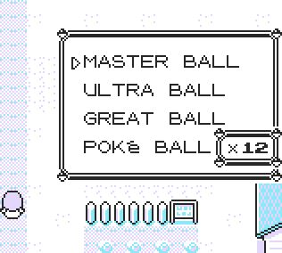

# 📜 ItemGiver+

This script adds a simple item menu that lets you:

- Select and obtain any item in the game, in any quantity (no need to know item hex IDs!)
- Delete the last item in your bag instantly by holding any button + B

It’s designed with simplicity in mind, making it especially useful when working with item-based ACE payloads.

# 

### Installation Options

The script is available in three different forms, depending on your needs:

- Auto Installer: 
Automatically finds unused memory and installs the script within the TimOS region. Ideal for quick setup with no manual address handling.

- Static Installer: 
Installs the script at a predefined memory address. Best suited for advanced users who want full control over memory layout.

- Standalone Version: 
Runs the script temporarily — useful for just getting the job done. The script is lost when a trainer battle starts.

