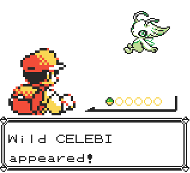

# Fully Custom Pokémon

# 

This is my first, and still my most beloved, script!

It features a completely custom Pokémon implementation that is fully functional throughout the entire game.

The script was originally coded directly in HEX instructions and was later ported to RGBDS format.

The Red/Blue version is currently bugged. I plan to rebuild the script later to make it more compact and lightweight.
