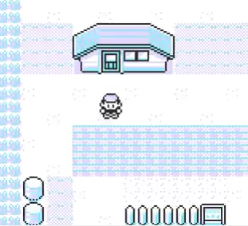

## MapBuilder

A simple but powerful script that lets you temporarily customize your current map!

# 

- Pressing button B places a tile block infront of the player.
- Use select button to choose between different tile blocks.


The script uses Map Script to always run in the backround until map changes.


**Red/Blue**
```
21 6e d3 36 bd 23 36 d8 f0 b3  
cb 4f 28 0f 21 9f 70 cd 1a 09  
f0 a8 77 21 dc 6e c3 1a 09 cb  
57 c8 21 a8 ff 34 c9
```

**Yellow**
```
21 6d d3 36 bc 23 36 d8 f0 b3  
cb 4f 28 0f 21 1f 6f cd 4b 07  
f0 a8 77 21 59 6d c3 4b 07 cb  
57 c8 21 a8 ff 34 c9
```
