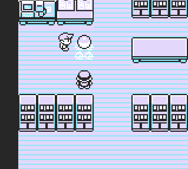

**Pushie**

# 

- Pressing button B infront of an npc/object allows to push it.
- It uses Map Script hijack to always run in the backround until map changes.
- A trainer battle will probably crash the game.

The script uses **Map Script Pointer** manipulation, which temporarily prevents normal game events. To restore them and unload the script, simply **leave the room and re-enter it**.

**Red/Blue**
<pre style="font-family: monospace;">
21 6e d3 3e bf 22 3e d8 77 c9  
f0 b3 cb 4f c8 21 28 d7 cb c6  
21 60 cd cb ce c9
</pre>

**Yellow**
<pre style="font-family: monospace;">
21 6d d3 3e be 22 3e d8 77 c9  
f0 b3 cb 4f c8 21 27 d7 cb c6  
21 60 cd cb ce c9
</pre>