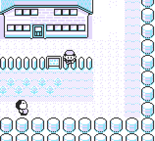

**Jump**

A simple script to jump by holding button B.

# 

The script uses **Map Script Pointer** manipulation, which temporarily prevents normal game events. To restore them and unload the script, simply **leave the room and re-enter it**.

**Red/Blue**
<pre style="font-family: monospace;">
21 6e d3 36 be 23 36 d8 c9 f0  
f8 e6 02 c8 21 36 d7 cb f6 c9
</pre>

**Yellow**
<pre style="font-family: monospace;">
21 6d d3 36 bd 23 36 d8 c9 f0  
f5 e6 02 c8 21 35 d7 cb f6 c9 
</pre>