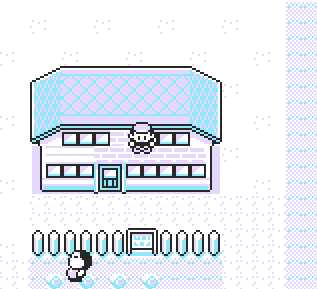

**Simple WtW**

Press button B enables walk through walls, releasing it disables it.

# 

The script resides on top stack unused space and is copied over during the initial execution. 

This script requires an **OAM DMA hijack** to constantly run in the backround.
To stop the script, simply **reset the game** or use the universal **DMA Unloader**.

**Red/Blue**
<pre style="font-family: monospace;">
21 d0 d8 11 15 df 0e 11 cd 3a  
12 f3 21 80 ff 36 cd 23 36 15  
23 36 df 23 36 e2 d9 f0 f8 cb  
4f 3e 00 28 01 3c ea 38 cd 0e  
46 3e c3 c9 
</pre>

**Yellow**
<pre style="font-family: monospace;">
21 cf d8 11 15 df 0e 11 cd ac  
0e f3 21 80 ff 36 cd 23 36 15  
23 36 df 23 36 e2 d9 f0 f5 cb  
4f 3e 00 28 01 3c ea 38 cd 0e  
46 3e c3 c9
</pre>
