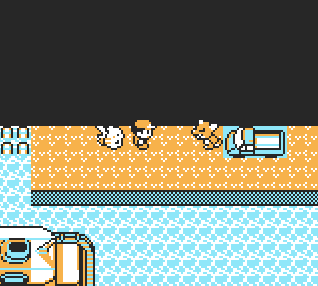

# 🚚 MewTruck+

Finally, the urban legend of Mew under the truck refreshed and accessible for everyone!

# 

MewTruck+ introduces an event where the player is able to push the truck located inside Vermillion Harbor.

Prerequisites
- Ability to use Surf and Strength.
- Access to Vermillion Harbor. If S.S.Anne has already left, you can use [surf down glitch](https://glitchcity.wiki/wiki/Surf_down_glitch) to re-enter the area.

Script activation
- In order to activate the script, you must already be inside Vermillion Harbor, otherwise the script will self abort.
- After that activate Strength and push the truck. Voila!

### ⚠️ Warning

This script uses MapScript pointer hijack to bypass certain ROM limitations.
Any active similar hijack may stop working while this is running.

-----
### Installation Options

Choose the format that best fits your setup:
- Installer Version: Permanently installs MewTruck+ at a specific memory address within the Script Selector.
Perfect for long-term use.
- Standalone Version: A temporary version that can run until a trainer battle starts. Great for single session or testing.
