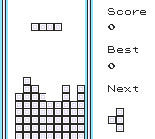

# 🧱 Polished Tetris

A refined Tetris mini-game inspired by the original Game Boy version.

# 

Based on offgao’s work, it is designed to integrate seamlessly with ACE, with the following additions:

* **Original control implementation** for smooth and responsive gameplay.
* **Enhanced graphics** — now it actually looks like a proper Tetris game.
* **Next block** — shows the upcomming block
* **Game pause** — so you don't have to lose your game when your GF asks you something.
* **Speed mode** — the speed increases every 16 lines, making the game progressively more challenging.
* **Score counters** — show me your high scores!

---

### Installation

Due to its size and architecture, the game is designed exclusively for use with TimOS Script Selector.

Please follow the instructions on the [main page](https://github.com/M4n0zz/Gen1PokeScripts) of this repo.

---

### Note

The game will break if you try to move the installation in any address other than $c800.

The above address is tied to the fundamental logic of Tetris tetromino creation. If it is changed, the tetromino shapes will be distorted!
