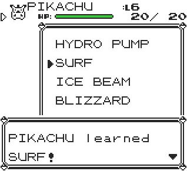

# 🎓 PokeTeacher+

Teach any move to any Pokémon in your party — instantly and effortlessly!

# 

PokeTeacher+ adds a clean and easy-to-use move selection menu, allowing full control over your Pokémon’s moveset. Ideal for game customisation, testing, or just having fun.

### ⚠️ Warning

This script uses an OAM DMA hijack to bypass certain ROM limitations.
Any other active DMA hijack will stop working while this is running.

-----
### Installation Options

Choose the format that best fits your setup:
- Installer Version: Permanently installs PokeTeacher+ at a specific memory address within the TimOS environment.
Perfect for long-term use.
- Standalone Version: A temporary version that runs until a trainer battle starts. Great for single session or testing.
