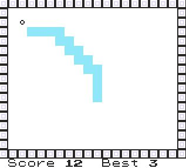

# 🐍 Polished Snake

A smooth and responsive Snake mini-game with enhanced visuals and gameplay.
Designed for fun, stability, and seamless integration in Gen 1 games.
# 

-----
### Features

- Custom graphics for a clean visual style
- Refined controls for natural and reliable gameplay
- Level-up system that increases speed as you progress
- Score counter to track your performance
- Best score autosave so your high score is remembered

----
### Installation

This script is available via installation in TimOS environment only, since it uses Nickname Writer's region to temporarily store Snake's internal buffer.

