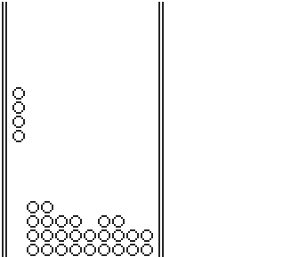

# 🧱 Tetris

A simple Tetris mini-game with enhanced gameplay based on the original Gameboy Tetris game.

It is a port of offgao's tetris game, designed for fun and seamless integration in Gen 1 games.
# 

### Features

- Refined controls for natural and reliable gameplay

----
### Installation

This script is available via installation in TimOS environment only and it consists of 2 parts, to be installed with the correct order.

Follow the instruction in the [main page](https://github.com/M4n0zz/Gen1PokeScripts) of the repo.

