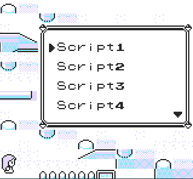

# Custom Scripts Menu

A template for building a **custom in-game script menu**.

# 

### ✔ Features

* Keep multiple scripts organized in a single menu
* Assign custom titles and execution pointers to each script
* Navigate through the scripts, run them with **A** or exit with **B**
* Add your labels and addresses with minimal setup

---

## How to Use

Choose the format that best fits your setup:
- Installer Version: The menu uses the TimOS selector to launch and it is permanently installed at a specific memory address.
Perfect for long-term use.
- Standalone Version: The menu is temporarily run from trainer battle data until a trainer battle starts. Great for single session or testing. Not requiring TimOS selector.

## How to Modify

1. Edit the `listitems` count in the correct .asm file.
2. Replace the script labels and addresses with your own ones.
3. Compile everything using **QuickRGBDS**.

---

## ⚠ Important Notes

* The Custom Menu uses a **DMA hijack** to dynamically overwrite its labels.
  You can still use a DMA hijack inside a selected script, but it will break any hijack already active.

* **Do NOT use this DMA hijack together with [BBMenu](https://github.com/M4n0zz/BBMenu).**
  BBMenu already relies on its own DMA hijack, and overwriting it will cause conflicts and break functionality.

