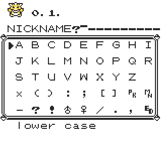

**Extended Nickname Writer**

# 

This is an extended version of TimoVM's Nickname Writer.

In this version, a nickname counter is displayed in the Pokémon’s name. It is specifically designed for entering large payloads, making it easier to keep track of your progress and avoid losing the nickname you are currently importing.

The script resides inside TimOS and replaces your current version. An existing TimOS setup is mandatory!

**Red/Blue**
<pre style="font-family: monospace;">
11 00 c8 21 c9 c7 73 23 72 21  
c6 d8 0e 70 c3 3a 12 af e0 b0  
47 21 91 cf 36 da 11 b5 d8 d5  
0e 01 79 80 27 47 c5 d5 21 90  
92 cd 63 c8 cb 30 21 10 96 cd  
63 c8 21 24 65 cd 75 13 0e 80  
21 4b cf d1 d5 2a 87 30 09 86  
12 13 23 81 12 4f 18 f3 d5 21  
00 c4 0e 01 cd df 15 2d cb fe  
20 fb cd 31 38 f0 b5 e6 0f 28  
f7 d1 e1 c1 1f 38 b3 54 5d 1f  
38 b4 1f e1 d8 e9 11 60 8f 78  
e6 0f cb 37 83 5f c3 48 18
</pre>

**Yellow**
<pre style="font-family: monospace;">
11 00 c8 21 c2 c7 73 23 72 21  
c5 d8 0e 70 c3 ac 0e af e0 b0  
47 21 90 cf 36 c5 11 b4 d8 d5  
0e 01 79 80 27 47 c5 d5 21 60  
8c cd 63 c8 cb 30 21 a0 8f cd  
63 c8 21 95 62 cd 35 11 0e 80  
21 4a cf d1 d5 2a 87 30 09 86  
12 13 23 81 12 4f 18 f3 d5 21  
00 c4 0e 01 cd bf 13 2d cb fe  
20 fb cd 1e 38 f0 b5 e6 0f 28  
f7 d1 e1 c1 1f 38 b3 54 5d 1f  
38 b4 1f e1 d8 e9 11 60 8f 78  
e6 0f cb 37 83 5f c3 fe 15
</pre>